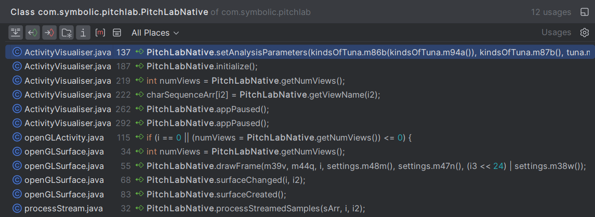
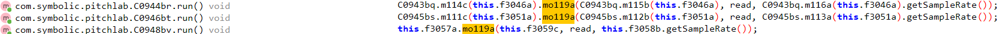
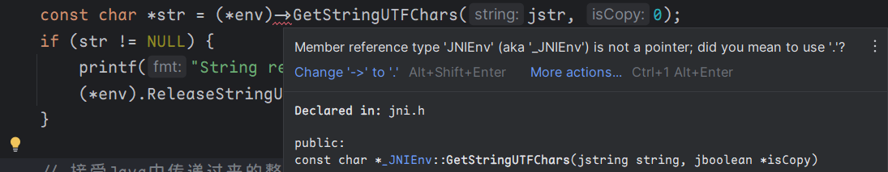

> PitchLab 是一个上古吉他调音器，由于其直观的界面被我喜爱，但是只支持 32 位，故想通过自编译 64 位 so 的方式使其复活
>
> 项目地址：https://github.com/aixiao0621/PitchLab-rev

## 简单启动

1. 创建包名相同的项目
2. 在 main/java/com.symbolic.pitchlab/ 下复制反编译的 JNI 注册类 PitchLabNative
3. 在 main 文件夹下建立文件夹 cpp，新建 CMakeLists.txt 文件 hello.c 文件

CmakeLists.txt:

```cmake
# For more information about using CMake with Android Studio, read the
# documentation: https://d.android.com/studio/projects/add-native-code.html.
# For more examples on how to use CMake, see https://github.com/android/ndk-samples.

# Sets the minimum CMake version required for this project.
cmake_minimum_required(VERSION 3.22.1)

# Declares the project name. The project name can be accessed via ${ PROJECT_NAME},
# Since this is the top level CMakeLists.txt, the project name is also accessible
# with ${CMAKE_PROJECT_NAME} (both CMake variables are in-sync within the top level
# build script scope).
project("PitchLab")
# 构建出的so文件名即为 libPitchLab.so

# Creates and names a library, sets it as either STATIC
# or SHARED, and provides the relative paths to its source code.
# You can define multiple libraries, and CMake builds them for you.
# Gradle automatically packages shared libraries with your APK.
#
# In this top level CMakeLists.txt, ${CMAKE_PROJECT_NAME} is used to define
# the target library name; in the sub-module's CMakeLists.txt, ${PROJECT_NAME}
# is preferred for the same purpose.
#
# In order to load a library into your app from Java/Kotlin, you must call
# System.loadLibrary() and pass the name of the library defined here;
# for GameActivity/NativeActivity derived applications, the same library name must be
# used in the AndroidManifest.xml file.
add_library(${CMAKE_PROJECT_NAME} SHARED
        # List C/C++ source files with relative paths to this CMakeLists.txt.
        hello.c)

# Specifies libraries CMake should link to your target library. You
# can link libraries from various origins, such as libraries defined in this
# build script, prebuilt third-party libraries, or Android system libraries.
target_link_libraries(${CMAKE_PROJECT_NAME}
        # List libraries link to the target library
        android
        log)


```

hello.c:

```c
#include "stdio.h"
#include "stdlib.h"
#include "jni.h"

//extern "C"
JNICALL
void Java_com_symbolic_pitchlab_PitchLabNative_appPaused(JNIEnv *env, jclass clazz){
    printf("appPaused\n");
}
```

4. 在 app 文件夹下的 build.gradle.kts 中增加 externalNativeBuild

```kotlin
    kotlinOptions {
        jvmTarget = "1.8"
    }
    externalNativeBuild {
        cmake {
            path = file("src/main/cpp/CMakeLists.txt")
            version = "3.22.1"
        }
    }
    buildFeatures {
        compose = true
    }
```

5. 构建项目，将构建出的 apk 解压，将其中的 so 文件放入原 apk 中重新签名安装即可


## Android so 文件

在 Android 开发中，**.so 文件**是指共享对象文件（Shared Object File），通常用于存储编译后的 C/C++ 代码，可以通过 Java Native Interface (JNI) 在 Android 应用中调用。

1. **生成 .so 文件**：
   - 当 Java 层的编码无法满足需求时，我们可以使用 C/C++ 编写代码，并生成 .so 文件。
   - 常见的应用场景包括加解密算法、音视频编解码等。
2. **适配不同 CPU 架构**：
   - Android 支持多种 CPU 架构，如 ARMv5、ARMv7、x86、MIPS、ARMv8、MIPS64 和 x86_64。
   - 每个 CPU 架构对应一个 ABI（Application Binary Interface），定义了其所支持的二进制文件格式规范。
3. **常见 ABI 类型**：
   - armeabi(ARMv6、ARMv5、ARMv4T、ARMv3、ARMv2)：适用于 ARM 架构，但性能较差。
   - armeabi-v7a：适用于 ARMv7 架构，性能较好，兼容 armeabi
   - arm64-v8a：适用于 ARMv8 64 位架构，兼容 armeabi-v7a 和 armeabi。
   - x86：适用于 x86 架构，兼容 armeabi
   - x86_64：适用于 x86 64 位架构，兼容 X86 和 armeabi
   - mips64：适用于 MIPS64 架构，兼容 mips
   - mips：适用于 MIPS 架构。
4. **文件结构**
   - **ELF Header**：   - 每个 ELF 文件开头都是它的头部结构，定义了整个文件的全局属性。   - 它包含了魔数（Magic Number）、文件类型（是否是可执行文件、共享库或核心转储等）、机器架构（如 x86、ARM 等）、入口点地址（如果可执行）、程序头表的位置和大小以及节头表的位置和大小等。 
   - **Program Header Table**：   - 介绍如何将文件的不同部分映射到内存中。   - 包含一个或多个段的元数据，例如每个段在文件中的偏移量、在内存中的虚拟地址、段的物理地址（如果相关）、段的大小以及必要的对齐约束等。
   - **Section Header Table**：   - 包含了文件中所有节 (section) 的索引，每个节都有特定的作用，一个节可能包含代码、数据、符号表或者调试信息等。   - 每个节头部定义了节的名称、大小、对齐、并提供了额外的信息，如在内存加载时的地址等。
   - **Text Section (.text)**：   - 包含程序的执行指令，是程序的代码部分。   - 这部分通常是只读的以防代码被意外修改。 
   - **Data Sections (.data and .bss)**：   - `.data`节包含已初始化的全局和静态变量。   - `.bss`（块开始符）节用于未初始化的全局和静态变量，通常在文件中不占用空间，仅代表这些变量在内存中的位置和大小。
   - **Relocation Sections (.rel and .rela)**：   - 包含了重新定位信息，作用是在程序被加载（或链接）到内存时，调整代码和数据中某些指定位置的地址。
   - **Symbol Table (.symtab)**：   - 包含了程序中的符号信息，这些信息包括函数、全局变量等的名称、位置和属性。 
   - **Dynamic Sections (.dynamic)**：   - 为动态链接提供所需信息，比如共享库名称、动态符号表、动态重新定位表等。
   - **String Table (.strtab and .shstrtab)**：   - `.strtab`节包含了符号表中的名字。   - `.shstrtab`节则包含了节头表中的名字。
   - **Debugging Information**：    - 包含用于调试的额外信息，如源码行号、源代码文件名称等。这部分通常不会包含在发布版的`.so`文件中。每个部分都适当排列和链接，以确保共享库能够被正确地加载和链接。像 GNU Binutils 这样的工具组可以用来检查和操作 ELF 文件，包括`readelf`和`objdump`等。Android 开发使用的 NDK 提供了这些工具的版本。在开发过程中，你可能需要依赖这些工具来诊断问题或更详细地理解你的共享库。


需要注意的问题：

1. **NDK 版本选择**

   NDK 平台不是后向兼容的，而是前向兼容的。推荐使用 app 的 minSdkVersion 对应的编译平台。

2. **混合使用不同 C++ 运行时编译的.so 文件**

   .so 文件可以依赖于不同的 C++ 运行时，静态编译或者动态加载。混合使用不同版本的 C++ 运行时可能导致很多奇怪的 crash，是应该避免的。作为一个经验法则，当只有一个.so 文件时，静态编译 C++ 运行时是没问题的，否则当存在多个.so 文件时，应该让所有的.so 文件都动态链接相同的 C++ 运行时。
   这意味着当引入一个新的预编译.so 文件，而且项目中还存在其他的.so 文件时，我们需要首先确认新引入的.so 文件使用的 C++ 运行时是否和已经存在的.so 文件一致。


## Java 层面的 Native 调用

渲染层位于 [ActivityVisualiser.java](..\code\pitchlab\app\src\main\java\com\symbolic\pitchlab\ActivityVisualiser.java) 类，通过将 jadx 代码复制并作简单 rename 处理到项目下，梳理出依赖类

可以看到所有的 native 调用


### processStreamedSamples

在  [processStream.java](..\code\pitchlab\app\src\main\java\com\symbolic\pitchlab\processStream.java) 类中存在下面方法：

```java
    @Override // com.symbolic.pitchlab.InterfaceC0940bn
    public void mo119a(short[] sArr, int i, int i2) {
        // 调用 Native 代码处理音频样本
        PitchLabNative.processStreamedSamples(sArr, i, i2);
    }
```

通过搜索 Jadx 中的方法调用判断参数



找到 jadx 中的函数调用，发现 import android.media.AudioRecord，具体实现如下：

```java
package com.symbolic.pitchlab;
import android.media.AudioRecord;

class C0948bv extends Thread {
    private InterfaceC0940bn f3057a;
    private AudioRecord f3058b;
    private short[] f3059c;
    public C0948bv(InterfaceC0940bn interfaceC0940bn, AudioRecord audioRecord, int i) {
        this.f3057a = interfaceC0940bn;
        this.f3058b = audioRecord;
        this.f3059c = new short[i];
    }
    @Override // java.lang.Thread, java.lang.Runnable
    public void run() {
        while (!interrupted()) {
            try {
                int read = this.f3058b.read(this.f3059c, 0, this.f3059c.length);
                if (read > 0) {
                    // 参数一：short[] 参数二：read 返回的数据的长度 参数三：通过 getSampleRate() 获取音频记录的采样率
                    this.f3057a.mo119a(this.f3059c, read, this.f3058b.getSampleRate());
                }
            } catch (Exception e) {
            }
        }
        this.f3057a = null;
        this.f3058b = null;
        this.f3059c = null;
    }
}
```

- 创建 `AudioRecord` 实例。

- 调用 `startRecording()` 开始录音。

- 循环调用 `read` 方法，从 `AudioRecord` 中读取数据。

  `read(byte[] audioData, int offsetInBytes, int sizeInBytes)`:

  - `audioData`: 要写入读取的数据的字节数组。
  - `offsetInBytes`: 开始写入数据的起始偏移量。
  - `sizeInBytes`: 要读取的字节数。

read 方法返回的值是实际读取的数据长度。如果返回值小于请求的读取长度，则可能到达了流的末尾。如果出现错误，返回值可能是一个负数，例如 `AudioRecord.ERROR` 或 `AudioRecord.ERROR_BAD_VALUE`

所以可以看到 `mo119a(short[] sArr, int i, int i2)` 中

参数一：写入读取的数据的字节数组 short[ ] 

参数二：read 返回的数组数据的长度 

参数三：通过 getSampleRate() 获取音频记录的采样率

*可以判断 PitchLabNative.processStreamedSamples(sArr, i, i2); 中的三个传参如上*


### (int) getNumViews

```java
		// 视图渲染
        int numViews = PitchLabNative.getNumViews();
        if (numViews > 0) {
            //m44q() 获取当前的视图模式，m56h() 设置指定的视图模式
            settings.m56h(settings.m44q() % numViews);
        }
        // 更新渲染设置
        settings.m54i(settings.m43r() | (1 << settings.m44q()));
```

通过 PitchLabNative.getNumViews() 获取 当前 settings 类中的变量 (int)f3073c 的视图模式


### (string)getViewName

Java 层用于在创建`AlertDialog.Builder` 对话框时根据 PitchLabNative.getNumViews() 的数值获取对应的 Name

```java
@Override // android.app.Activity
    protected Dialog onCreateDialog(int i) {
        switch (i) {
            case 100:
                int numViews = PitchLabNative.getNumViews();
                CharSequence[] charSequenceArr = new CharSequence[numViews + 1];
                for (int i2 = 0; i2 < numViews; i2++) {
                    charSequenceArr[i2] = PitchLabNative.getViewName(i2);
                }
                charSequenceArr[numViews] = "Options";
                AlertDialog.Builder builder = new AlertDialog.Builder(this);
                builder.setTitle("PitchLab Views");
                builder.setSingleChoiceItems(charSequenceArr, -1, new DialogInterface$OnClickListenerC0936bj(this, numViews));
                return builder.create();
            default:
                return null;
        }
    }
```

PitchLabNative.getViewName(i2) 传参 由 PitchLabNative.getNumViews() 获取的 int 返回对应的 (string) Name


### setAnalysisParameters

```
kindsOfTuna.m86b(kindsOfTuna.m94a()):这个参数旨在移除 kindsOfTuna 名称前的 '!' 标记（如果有的话），并传递处理后的名称。
kindsOfTuna.m87b():返回了一个整数数组，该数组代表为音乐乐器预设的调音方案中的音符频率分配。
tuna.m28b():返回一个浮点数组，该数组涉及当前选择的调音方案的精细节拍设置。

settings.m63e() 返回 A4 音高的参考频率，默认是 440Hz。这是音乐标准 tuning 的重要组成部分。
settings.m46o() 返回调音阈值。在用户接口中这可能影响到判定为 "in tune" 的敏感度。
i 这个参数是根据 settings.m66d() 的结果来设置的，表示不同的分析模式（例如 -1、1 可以表示更激进或更宽容的分析模式）。在音频分析领域，这可能会调整诊断精度和性能之间的权衡。
i2 是根据 settings.m41t() 的结果来设置的。在您提供的代码中，其值依赖于特定的软件版本字符串。不同的值可能对应不同的算法优化或特性。
```

#### 第一个参数 (kindsOfTuna.m86b(kindsOfTuna.m94a())):

假设当前选中的 kindsOfTuna 项目是代表吉他标准调音的一个对象，其名称可能为 "Guitar, Standard"。那么，如果没有 '!' 这个特殊字符前缀，m94a() 将返回 "Guitar, Standard"，而 m86b() 也将返回 "Guitar, Standard"。因此，该参数的值可能为：
   `"Guitar, Standard"`

#### 第二个参数 (kindsOfTuna.m87b()):

如果我们假设 kindsOfTuna 表示的类包含了识别音符的整数数组，这个数组可能是音符的 MIDI 编号。例如，对于 "Guitar, Standard" 调音 "E2 A2 D3 G3 B3 E4"，相关的 MIDI 编号数组可能是 [40, 45, 50, 55, 59, 64]。所以这个参数的可能值如下：
   `[40, 45, 50, 55, 59, 64]`

#### 第三个参数 (tuna.m28b()):

假设用户选择了一个定制的调音方案，那么 tuna 对象中 f3096c 可能存储了每个音符针对 A4 的偏差值。例如，如果用户选择了一个理论上的 "Equal Temperament" 调音，它可能简单地设定所有 12 个音符为无偏差（即以 A4 为基准的 0 偏差），那么 m28b() 返回的浮点数组可能如下：
   `[0.0f, 0.0f, 0.0f, 0.0f, 0.0f, 0.0f, 0.0f, 0.0f, 0.0f, 0.0f, 0.0f, 0.0f]`
如果是一个特定的历史调音方案，例如 "Just Intonation"，则每个音符的偏差值将与等温调音有所不同，可能会有类似以下值的数组：
   `[-9.7f, -7.8f, -3.9f, -5.9f, 0.0f, -7.8f, -9.8f, -11.7f, -1.9f, -13.7f, -15.6f, -1.9f]`

#### 第四个参数 (settings.m63e()):

这个参数对应 A4 音高的参考频率。通常使用的标准值是 440 Hz，但一些用户或特定音乐体裁可能会使用不同的频率。因此，settings.m63e() 可能返回标准的 440.0f 或者其他值，比如 432.0f 用于巴洛克音乐或 443.0f 在某些交响乐中。所以，该参数的可能值为：
   `440.0f`

#### 第五个参数 (settings.m46o()):

调音阈值表示在判断音符是否已经准确调整时可接受的误差范围。这个参数通常是一个小值，例如，如果容忍度设置为 ±5 分贝，则可能的值为：
   `5.0f`

#### 第六个参数 (i):

这是一个分析速率，由 settings.m66d() 返回，它可能与应用中的滑条或设置有关，用户可以选择“快速”，“中速”或“慢速”分析。这个值可以是 -1，0 或 1，具体意义取决于应用程序中的实现和文档。一个假设的示例值可能是：
   `0 // 代表平衡的分析速率`

#### 第七个参数 (i2):

根据 settings.m41t() 返回的可能是一个音频分析的版本号或配置。假设它与特有的优化版本有关，可能返回一个整数或字符串。不过在提供的代码中，我们看到这个方法相关的返回值为版本字符串。假设最新的版本是 1_0_22，那么可能的值将是：
   `"1_0_22"`
现在我们有了一个完整的示例调用 PitchLabNative.setAnalysisParameters 的可能参数集合：

```java
PitchLabNative.setAnalysisParameters(
    "Guitar, Standard",         // 第一个参数：乐器名（调音类型）
    new int[] {40, 45, 50, 55, 59, 64}, // 第二个参数：音符的 MIDI 值数组
    new float[] {0.0f, 0.0f, 0.0f, 0.0f, 0.0f, 0.0f, 0.0f, 0.0f, 0.0f, 0.0f, 0.0f, 0.0f}, // 第三个参数：调音方案中的浮点值数组
    440.0f,                      // 第四个参数：A4 音高参考频率
    5.0f,                        // 第五个参数：调音阈值
    0,                           // 第六个参数：分析速率
    "1_0_22"                     // 第七个参数：版本号
);
```


### surfaceCreated

Java 层调用：

```java
    /**
     * 当 GLSurfaceView 的表面被创建时调用此方法。
     *
     * @param gl10 GL10 接口是一个接口的实例，开发者通过调用 GL10 接口中提供的方法来执行具体的图形渲染命令
     * @param eGLConfig EGL 配置对象
     */
    @Override
    public void onSurfaceCreated(GL10 gl10, EGLConfig eGLConfig) {
        // 通知 native 层表面已创建
        PitchLabNative.surfaceCreated();
    }
```


### surfaceChanged

```
PitchLabNative.surfaceChanged(width, height);
```

传入两个参数分别是 屏幕的长和宽，用于通知 native 层的 surface 更改

在 Java 层调用中，使用 nSurfaceChanged，同时增加参数 GL10 对象：

```java
     * 当 GLSurfaceView 的表面大小发生变化时调用此方法。
     *
     * @param gl10 GL10 接口。
     * @param i 新的宽度。
     * @param i2 新的高度。
     */
    @Override
    public void onSurfaceChanged(GL10 gl10, int i, int i2) {
        // 通知 native 层表面大小发生变化
        PitchLabNative.surfaceChanged(i, i2);
        // 更新视图大小
        this.f3114a.f3105e = i;
        this.f3114a.f3106f = i2;
    }
```

### drawFrame

```java
PitchLabNative.drawFrame(m39v, m44q, i, settings.m48m(), settings.m47n(), (i3 << 24) | settings.m38w());

        // int 获取 temperament 编号
        int m39v = settings.m39v();
        // int 当前视图模式
        int m44q = settings.m44q();
        // int i
        // int 音高容忍度 m48m()
        // int 音名显示风格 m47n()
        // int (i3 << 24) | settings.m38w()[上次应用使用的音高分析算法编号] 值为 1 or 0
```

后面代码的 `(i3 << 24)` 是一个位操作，它将 `i3` 的值左移 24 位。这通常用于在一个整数中设置高位的值，比如在某些应用中，将数据打包到一个整数中表示不同的参数。

`| settings.m38w()` 将 `i3` 左移 24 位的结果通过按位或操作与 `settings` 类的一个方法 `m38w()` 的返回值合并。这个操作可能用于设置一个含有多个参数的标志位或配置值。其中 `settings.m38w()` 返回的值设置了整数的低位，而 `(i3 << 24)` 设置了高位。

这样的位操作通常在需要将多个配置选项打包到一个单独的整数中时使用，在图形渲染、网络通信、文件权限设置等方面较为常见。

## Android OpenGL ES 的实践

### GLSurfaceView 扩展类

`openGLActivity extends GLSurfaceView`: 这个类是 `GLSurfaceView` 的一个扩展，负责创建一个可以用于绘制 OpenGL ES 图形的表面。在你的应用中，你会创建这个类的实例并将其设置为 Activity 的内容视图（通常通过`setContentView()`方法）。它封装了渲染表面的管理、渲染循环和与 OpenGL ES 的上下文交互。此类的对象会在适当时候自动调用渲染器的回调方法，如 `onSurfaceCreated()`, `onSurfaceChanged()`, `onDrawFrame()` 等。

在这个自定义的 `openGLActivity` 类中，你会配置 `GLSurfaceView`，包括设置渲染模式（比如，持续渲染或按需渲染），以及绑定一个实现了 `GLSurfaceView.Renderer` 的渲染器。

### GLSurfaceView.Renderer 实现类

`openGLSurface implements GLSurfaceView.Renderer`: 这个类实现了 `GLSurfaceView.Renderer` 接口，即它提供了 OpenGL ES 渲染循环的三个核心方法：`onSurfaceCreated(GL10 gl10, EGLConfig eGLConfig)`, `onSurfaceChanged(GL10 gl10, int width, int height)`, 和 `onDrawFrame(GL10 gl10)`。任何实现了这个接口的类都将具体定义在 OpenGL ES 渲染过程中会发生什么。

- `onSurfaceCreated`: 用于执行一次性初始化，如设置背景色，初始化纹理数据等。
- `onSurfaceChanged`: 当视图大小发生改变时被调用，处理视图的尺寸变化。
- `onDrawFrame`: 每次重绘时调用，执行实际的渲染工作。

### 使用示例

当 `GLSurfaceView` 实例准备好并需要绘制或处理时，它将调用 `GLSurfaceView.Renderer` 接口中相应的方法。所以 `openGLSurface` 作为 renderer 的实现，是实际执行图形绘制和 OpenGL 状态管理的地方。

在 `openGLActivity` 的 onCreate 方法中创建 `openGLSurface` 类的实例，并通过 `GLSurfaceView` 的 `setRenderer` 方法将其设置为渲染器，像下面这样：

```java
public class openGLActivity extends GLSurfaceView {
    public openGLActivity(Context context) {
        super(context);
        // 设置 OpenGL ES 版本等配置…
        setRenderer(new openGLSurface());
    }
}
```

```java
public class openGLSurface implements GLSurfaceView.Renderer {
    public void onSurfaceCreated(GL10 gl10, EGLConfig eGLConfig) {
        // 初始化代码…
    }

    public void onSurfaceChanged(GL10 gl10, int width, int height) {
        // 视图改变代码…
    }

    public void onDrawFrame(GL10 gl10) {
        // 绘图代码…
    }
}
```

这样设置后，`openGLActivity` 创建并管理 `GLSurfaceView`，而 `openGLSurface` 负责定义具体的渲染逻辑

## Love From C

增加 C 代码，更新 CMakeLists.txt ; 分布在 drawFrame 和 surfaceChanged 中调用使其进行屏幕渲染

## 在 processStreamedSamples 中添加音频处理逻辑

需要使用 FFT 这种外部库文件，FFTW 编译过不了，最后选择 kiss-fft 这个库

问题：在 jni.c 中无法调用 这个 cpp 写成的 fft 库函数，报错：Compile error 'nullptr' undeclared identifier 原因是 C 没有 nullptr，故将 jni.c 改为 cpp 文件，出现下面错误？Alt+Shift+Enter 一把梭

对读入的音谱数据进行 FFT 处理之后就可以得到 `频率` 和其对应的 `分贝数`，尽管已经对其进行加窗操作，但在低频率时仍然会出现错误，显示的频率是实际频率的二倍。

通过增加一个 buffer，等待一个 4096*4 的 buffer 被填充后再做 fft，设置的 fft_size 大小为 4096 * 2，出现了低音正确，高音为实际的一半的（eg 144hz 显示为 72hz）

如果将 fft_size 设为 4096*4，低音就会显示为实际的二倍，高音正确（eg 74hz 显示为 148hz）

## openGL 启动

目前可以正常 Log 出来频率了，但 openGL 咕咕了，前面的区域以后再来探索吧！