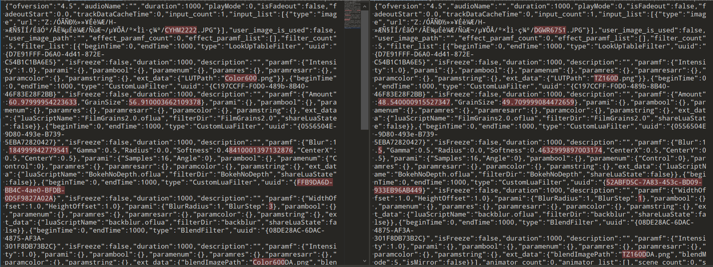
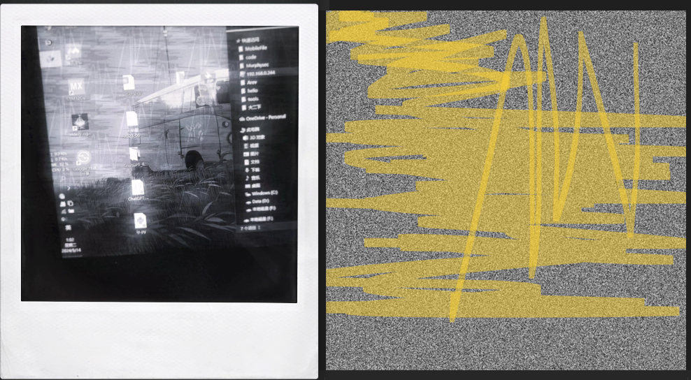

> 网上冲浪时遇到的 APP，FIMO 家的同款相机软件，但是没有更新，官网也无了，只有两个可模拟的胶片，试图为其增加新的胶片效果 

## APK 文件结构

在 apk 的 `assets/static` 目录下存在下面文件结构：

```bash
.
├── camera
│     └── PLCamera1
│         ├── camera-cover.png
│         ├── camera-photo-shadow.png
│         └── cover.png
├── camera.json
├── default.json
├── images
│     └── lens-cover1.png
├── of
│     ├── Color600.zip
│     ├── Frame-1.zip
│     ├── MixPhoto.zip
│     └── TimeZero.zip
├── of.json
├── paper
│     ├── PLPaper1
│     │     ├── cover.png
│     │     ├── desc-en.png
│     │     ├── desc-zh.png
│     │     ├── display-cover-preview.png
│     │     ├── display-cover.png
│     │     ├── sample-1.png
│     │     ├── sample ...
│     └── PLPaper2
│         ├── cover.png
│         ├── ...
└── paper.json
```

通过使用 APP 可以判断 Color600.zip 和 TimeZero.zip 属于胶片文件，提供不同的胶片效果，所以再看看 zip 有什么

```bash
.
├── BokehNoDepth
│     └── BokehNoDepth.oflua
├── FilmGrains2.0
│     ├── FilmGrains2.0.oflua
│     ├── noise.png
│     └── noise2.png
├── TZ160D.png
├── TZ160DDA.png
├── Thumbs.db	// 缓存文件，忽略
├── backblur
│     └── backblur.oflua
└── effect0.ofeffect
```

根据对比可以判断不同的效果是通过其中的 lua 脚本实现的，对比`effect0.ofeffect`这个配置文件：



可以发现三个 oflua 脚本和其使用的 png 图像实现了具体的滤镜效果

1. **BokehNoDepth**
   - **BokehNoDepth.oflua**：Lua 脚本，用于实现无深度的散景效果。在`effect0.ofeffect`文件中，它与自定义滤镜（CustomLuaFilter）关联，用来调整模糊度（Blur）、伽马（Gamma）、半径（Radius）、柔和度（Softness）等参数。
2. **FilmGrains2.0**
   - **FilmGrains2.0.oflua**：Lua 脚本，用于创建电影颗粒效果。它在`effect0.ofeffect`文件中作为自定义滤镜的一部分，控制颗粒量和颗粒大小。
   - **noise.png** 和 **noise2.png**：用于生成颗粒效果的噪声纹理图像。
3. **backblur**
   - **backblur.oflua**：这是另一个 Lua 脚本，用于实现背景模糊效果。在`effect0.ofeffect`文件中，它控制模糊半径和模糊步骤。
4. effect0.ofeffect 用于调整胶片效果的参数配置

## 再来一个！

修改`camera.json`、`of.json`、`paper.json`配置文件中的内容，增加新的胶片效果`helloworld`

修改 zip 里的`FilmGrains2.0`目录下的两张噪声图像，经过检验噪声图像会在处理源图像时随机叠加在图像上

修改 zip 里的两张`PNG`图像，这里为其简单添加一个黑白滤镜效果以验证可行性

修改 aip 里的`effect0.ofeffect`配置文件的参数

将新的 zip 文件以及更新后的`camera.json`、`of.json`、`paper.json`、`PLPaperX`文件夹重新打包即可，示例效果如下：



确实是变黑白了，噪声图像在成像中也可见

## 代码里有什么？

通过搜索 `static/` 可以找到一些代码对其的使用：

```java
Resources resources = this.c.getResources();
e eVar = e.a;
f0.a(resources, "resources");
String a = eVar.a("static/camera.json", resources);
String a2 = e.a.a("static/paper.json", resources);
String a3 = e.a.a("static/of.json", resources);
String a4 = e.a.a("static/default.json", resources);
Gson gson = new Gson();
try {
    d.i().addAll((Collection) gson.fromJson(a, new a().getType()));
    d.k().addAll((Collection) gson.fromJson(a2, new b().getType()));
    d.j().addAll((Collection) gson.fromJson(a3, new c().getType()));
    defaultCameraInfo = (DefaultCameraInfo) gson.fromJson(a4, DefaultCameraInfo.class);
} catch (Throwable e) {
    d.g.a();
    g.j.a.a.g.c.a(obj, e);
    return c1.a;
}
```

大概的过程：

1. **初始化 HashMap 和 ArrayList**：
   - `HashMap<String, Camera> cameraMap`
   - `HashMap<String, Paper> paperMap`
   - `HashMap<String, Of> ofMap`
2. **加载和解析 JSON**：
   - `loadModels`方法会加载和解析`static/camera.json`，`static/paper.json`，和`static/of.json`中的数据。
3. **JSON 解析**：
   - 使用`Gson`库将 JSON 数据解析为 Java 对象，存储在前面创建的 HashMap 中。
   - 例如，对于`Of`对象，使用的是`TypeToken<ArrayList<Of>>`来指定`Gson`如何将 JSON 字符串解析成`Of`对象列表。

`of.json`文件中的数据被解析为一个`ArrayList`类型的`C2054Of`对象列表。这个过程主要发生在`init`方法的异步执行部分。

下面是具体的处理步骤和逻辑：

> ### 解析`of.json`文件
> 1. **加载和解析 JSON**：
>    - 使用`Gson`对象调用`fromJson`方法，将从资源中读取的`of.json`文件的内容解析为`Of`对象的列表。
>    - 使用`TypeToken`来指定`Gson`需要转换成的具体类型，这里是`ArrayList<Of>`。
>
> 2. **存储解析后的数据**：
>    - 将解析得到的`Of`列表添加到`f26154f`，这是一个静态的`ArrayList`，用于存储`Of`对象。
>
> ### 处理解析后的`Of`对象
> 1. **设置文件路径**：
>    - 遍历解析后的`C2054Of`列表，为每个`C2054Of`对象设置正确的文件路径。这是通过获取应用缓存文件目录的路径并与`Of`对象中的`fileName`属性结合来实现的，确保每个对象都指向其对应的文件。
>
> 2. **更新`Of`对象映射**：
>    - 创建或更新一个`HashMap`（`f26153e`），该映射使用每个`Of`对象的`fileName`作为键，`Of`对象本身作为值。这允许通过文件名快速访问每个`Of`对象，即 zip 文件
>
> ### 整合和应用`Of`对象
> - **为`Paper`和`Camera`模型设置`Of`对象**：
>    - 遍历`Paper`和`Camera`对象的列表，根据它们存储的`ofListEffect`和`ofListBorder`（这些列表存储了`fileName`的引用）来从`f26153e`映射中检索相应的`Of`对象，并设置为`Paper`或`Camera`对象的属性。
>    - 例如，一个`Paper`对象可能有一个效果列表（`ofListEffect`），该代码通过遍历这个列表，并使用列表中的每个文件名从`f26153e`映射中检索`Of`对象，然后将它们设置为该`Paper`对象的`ofModelList`属性。
>

## 哪里的 Lua？

对 apk 内的 `.so` 进行搜索

```bash
for file in *; do
  if strings "$file" | grep -q lua; then
    echo "Found in file $file:"
    strings "$file" | grep lua
  fi
done
```

结果显示：

```bash
Found in file libapp.so:
	_evaluateAssertion
	evaluate:source
	_ChainedEvaluation@83105126
	evaluate
	__AnimatedEvaluation&Animation&AnimationWithParentMixin@831051268
	_AnimatedEvaluation@83105126
	startRuleEvaluation
	evaluateMessage
	_evaluateAssertion@0150898
	Invalid number of arguments in evaluate response8
Found in file libflutter.so:
            // Evaluate the cubic at T = (sk_VertexID / 2^kMaxResolveLevel).
            // dx and dy uniformly, we can throw it out completely after evaluating the derivative
	_evaluateAssertion
	evaluate:source
        // Evaluate the conic weights at T.
        // Evaluate the cubic at T. Use De Casteljau's for its accuracy and stability.
        // Pack the arguments for the evaluation stage.
Found in file liborangefilterjni.so:
	_ZN12OrangeFilter6LuaCpp28RegisterLuaStateCloseHandlerEP9lua_StatePFvS2_E
	_ZNK12OrangeFilter14AnimationCurve8evaluateEf
	_ZNK12OrangeFilter14AnimationCurve12evaluateQuatEf
	_ZNK12OrangeFilter14AnimationCurve18evaluateMultiValueEfPf
	lua_script
	N12OrangeFilter6LuaCpp19concrete_any_pusherINS0_9luaObjectEEE
	N12OrangeFilter6LuaCpp3any6holderINS0_9luaObjectEEE
	orangefilter.lualib
	There is no function in lua %s
	lua_pcall default error
	Call lua [requiredFrameData] error: %s
	Call lua [onApplyParams] error: %s
	...
	luaopen_%s
/usr/local/share/lua/5.3/?.lua;/usr/local/share/lua/5.3/?/init.lua;/usr/local/lib/lua/5.3/?.lua;/usr/local/lib/lua/5.3/?/init.lua;./?.lua;./?/init.lua
	/usr/local/lib/lua/5.3/?.so;/usr/local/lib/lua/5.3/loadall.so;./?.so
	lua_debug>
Found in file libvenus2jni.so:
	lua_script
```

显而易见，lua 的混淆出现在`liborangefilterjni.so`中，根据网络上的信息，这个库是[YY 内部的设计工具](https://github.com/mr-loney/ae2of_tools/issues/1)。结合 jadx 中对该 so 的调用，有`/* renamed from: com.yy.orangefilter.R */`字样出现，可以确定就是该工具

其完善的兄弟产品 FIMO 也使用了`liborangefilterjni.so`，polr 看起来更像是 FIMO 的 demo?

## 未知的后续

oflua 的混淆如何实现？还能做什么：

* 追踪相纸 zip 文件在 app 中的调用，app 是如何处理和调用每个 zip 的
* 从文件选择器入手，看每一张相片是如何生成的，图片是如何被处理的

能不能将 FIMO 中数量巨大的胶片效果移植到 polr 上？
