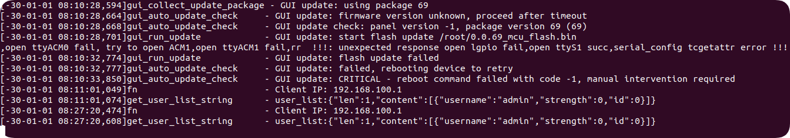

## 背景：
针对某国产打印机固件进行漏洞挖掘，LoongArch 架构，已知 mian ELF 中包含 moongose 7.12 漏洞，需要在 QEMU 中模拟运行以测试 POC。

## How2Run:
解包后的文件系统

```bash
total 453032
-rw-r--r--@ 1 az  staff   185B Nov 17 15:03 boot.cfg
-rw-r--r--@ 1 az  staff    33B Nov 17 15:03 boot.cfg.md5
-rw-r--r--@ 1 az  staff    27M Nov 17 15:03 initrd.cpio
-rw-r--r--@ 1 az  staff    33B Nov 17 15:03 initrd.cpio.md5
-rw-r--r--@ 1 az  staff   367K Nov 17 14:48 mcu_code.bin
-rw-r--r--@ 1 az  staff    33B Nov 17 15:03 mcu_code.bin.md5
-rw-r--r--@ 1 az  staff    39M Nov 17 14:48 mcu_flash.bin
-rw-r--r--@ 1 az  staff    33B Nov 17 15:03 mcu_flash.bin.md5
-rw-r--r--@ 1 az  staff   150M Nov 17 15:03 rootfs.cpio.gz
-rw-r--r--@ 1 az  staff    33B Nov 17 15:03 rootfs.cpio.gz.md5
-rwxr-xr-x@ 1 az  staff   5.0M Nov 17 14:47 vmlinuz
-rw-r--r--@ 1 az  staff    33B Nov 17 15:03 vmlinuz.md5
```

+ `vmlinuz`: 内核（Kernel） ELF 格式，不带 EFI Stub，得用 QEMU 的 `-kernel` 参数加载。
+ `initrd.cpio`: 这是 **初始内存磁盘**（Initial Ramdisk）在内核启动后、真正挂载最终根文件系统之前，提供一个临时的根目录环境，用于加载必要的驱动模块或执行初始化脚本
+ `rootfs.cpio.gz**`: 这是 **真正的系统文件**。通常 `initrd.cpio` 里的脚本运行起来后，会把这个大家伙解压或者挂载起来进入真正的系统。
+ `boot.cfg`: 记录内核启动参数（cmdline），告诉内核“我是谁？我在哪？我要运行什么程序？
+ `MCU 相关`:（`mcu_code.bin`, `mcu_flash.bin`）：微控制器单元（MCU）的固件文件。


### 安装 QEMU
目标架构是 **LoongArch**，使用 `qemu-system-x86_64` 是无法运行的。

**安装编译依赖：**

```bash
sudo apt update
sudo apt install git libglib2.0-dev libfdt-dev libpixman-1-dev zlib1g-dev ninja-build build-essential python3
```

**下载 QEMU 源码：**

```bash
wget https://download.qemu.org/qemu-8.1.0.tar.xz
tar xvJf qemu-8.1.0.tar.xz
cd qemu-8.1.0
```

**配置编译目标（只编译 LoongArch 以节省时间）：**

```bash
./configure --target-list=loongarch64-softmmu
```

**编译并安装：**

```bash
make -j$(nproc)
sudo make install
```


### 准备启动所需文件
#### 引导
QEMU LoongArch 需要 UEFI 固件来引导内核。也就是QEMU_EFI.fd文件，获取方式：

1. 在龙芯 QEMU 维护者 Yang Xiaojuan 的个人仓库，里面存放了适配 QEMU 的配套固件。**GitHub 地址**: [https://github.com/yangxiaojuan-loongson/qemu-binary](https://github.com/yangxiaojuan-loongson/qemu-binary)

QEMU 启动命令中指向这个文件的路径即可（例如 `-bios ./QEMU_EFI.fd`）

2. 从 EDK2 源码编译

#### 磁盘
`boot.cfg` 显示 `root=/dev/mmcblk0p3 rootfstype=ext4`。这意味着这台设备**不是**通过 initrd（内存盘）跑系统的，而是把系统装在硬盘（eMMC）上，内核直接挂载硬盘启动。

需要把 `rootfs.cpio.gz`恢复成一个**虚拟硬盘文件**，然后让 QEMU 像挂载硬盘一样挂载它。

把 rootfs.cpio.gz 变成 ext4 格式的镜像，在 `_rootfs.cpio.gz.extracted` 目录操作：

**1. 解压 cpio 内容到临时目录**

```bash
# 在 _rootfs.cpio.gz.extracted 目录下
mkdir rootfs_temp
cd rootfs_temp

# 解压 cpio 
cpio -idv < ../0
```

**2. 打包成 ext4 镜像** 回到上一级目录，使用 `virt-make-fs`或者手动制作。 _(如果没有 _`_libguestfs-tools_`_，请先 _`_sudo apt install libguestfs-tools_`_)_

```bash
cd ..
# 制作一个 1GB 的 ext4 镜像，放入刚才解压的内容
virt-make-fs --type=ext4 --size=1G ./rootfs_temp rootfs.img
```

_现在得到了一个标准的硬盘镜像 _`_rootfs.img_`_。_


### 构建启动命令
#### LoadImage(): Unsupported
_这一步需要“翻译” _`_boot.cfg_`_ 里的参数给 QEMU 用。_

+ **原配置**_：_`_root=/dev/mmcblk0p3_`
+ **QEMU配置**_：_`_root=/dev/vda_`_ (因为在 QEMU virt 机器里，第一个虚拟硬盘叫 vda)_
+ **原配置**_：_`_init=/linuxrc_`
+ **QEMU配置**_：保留不变，或者改为 _`_/bin/sh_`_ 进行调试。_

**执行以下命令启动：**

```bash
qemu-system-loongarch64 \
    -M virt \
    -m 4G \
    -cpu la464 \
    -kernel vmlinuz \
    -initrd ./initrd.cpio \
    -drive file=rootfs.img,format=raw,index=0,media=disk \
    -append "root=/dev/vda rw rootfstype=ext4 init=/linuxrc console=ttyS0" \
    -nographic \
    -bios ./QEMU_EFI.fd
```

运行结果：

```bash
...
EndOfDxe: VenMedia(1428F772-B64A-441E-B8C3-9EBDD7F893C7)/kernel.
InstallProtocolInterface: 5B1B31A1-9562-11D2-8E3F-00A0C969723B E32B140
QemuLoadKernelImage: LoadImage(): Unsupported
```

**ERROR：内核格式不兼容。** 虽然挂载了硬盘，但是 QEMU 依然无法启动内核：

+ **原因**：用的 `vmlinuz` 是 **ELF** 格式（从固件里直接解包出来的）。
+ **冲突**：使用的 QEMU 固件（`QEMU_EFI.fd`）是标准的 UEFI，它**只接受 EFI (PE32+)** 格式的内核。它看不懂 ELF 格式，所以直接拒收。


#### 获取支持UEFI的kernel
得拿到一个支持 UEFI 启动的内核，直接从 **ArchLinux LoongArch 的官方镜像源**获取

下载并提取内核，不下载 600MB 的 ISO ，直接下载内核包（约 100MB），安装 `zstd` 来解压它。

**安装解压工具**：

```bash
sudo apt update
sudo apt install zstd
```

**下载官方内核包**：

```bash
# 下载内核包 (文件名可能随版本更新变化，这里我们用通配符处理)
wget -r -nd -np -A "linux-*.pkg.tar.zst" -R "linux-headers*" https://mirrors.wsyu.edu.cn/loongarch/archlinux/core/os/loongarch64/
```

_注意：如果上面的命令下载了多个文件或者速度慢，可以手动访问 _[_这个链接_](https://www.google.com/url?sa=E&source=gmail&q=https://mirrors.wsyu.edu.cn/loongarch/archlinux/core/os/loongarch64/)_，下载任意一个以 _`_linux-_`_ 开头（__**不要**__带 headers）的 _`_.zst_`_ 文件。解压并获取 vmlinuz_

```bash
# 解压下载的包 (.zst -> .tar -> 文件)
zstd -d linux-*.pkg.tar.zst
tar -xvf linux-*.pkg.tar

# 提取内核文件并重命名为 vmlinuz-efi
# ArchLinux 的内核通常放在解压后的 boot/ 目录下，名为 vmlinuz-linux
cp boot/vmlinuz-linux ./vmlinuz-efi

# 验证一下（重要！）
file vmlinuz-efi
# 必须看到 "PE32+ executable" 或 "MS-DOS executable"

iot@iot-virtual-machine:~/Desktop/qrun$ file vmlinuz-efi 
vmlinuz-efi: MS-DOS executable PE32+ executable (EFI application) (stripped to external PDB), for MS Windows
```

现在有：

+ `vmlinuz-efi` (刚提取的，支持 UEFI)
+ `rootfs.img` (之前做好的系统镜像)
+ `initrd.cpio` (官方原版 28MB 那个文件，作为辅助)

我们使用 `init=/bin/sh` 强制进入命令行，这样可以忽略驱动不兼容的问题，直接操作文件系统。

```bash
qemu-system-loongarch64 \
    -M virt \
    -m 4G \
    -cpu la464 \
    -kernel vmlinuz-efi \
    -initrd ./initrd.cpio \
    -drive file=rootfs.img,format=raw,index=0,media=disk \
    -append "root=/dev/vda rw rootfstype=ext4 init=/bin/sh console=ttyS0" \
    -nographic \
    -bios ./QEMU_EFI.fd
```

运行结果：

```bash
SetUefiImageMemoryAttributes - 0x000000000DBB0000 - 0x0000000000040000 (0x0000000000000008)
Starting OTA server: [   19.040172] /dev/mmcblk0p4: Can't lookup blockdev
[   19.058993] /dev/mmcblk0p4: Can't lookup blockdev
[   19.073047] /dev/mmcblk0p4: Can't lookup blockdev
[   19.082371] /dev/mmcblk0p4: Can't lookup blockdev
mount: mounting /dev/mmcblk0p4 on /data failed: No such file or directory
mount /data failed
Please press Enter to activate this console. 

/ #
/ #
/ # ls
[1]+  Stopped (tty output)       ls
```

非常经典的 **"TTY Job Control 抢占"** 现象

虽然在参数里加了 `init=/bin/sh`，但同时使用了 `-initrd`。 Linux 的启动逻辑是：

1. **先加载 initrd**
2. 内核执行 initrd 里的默认启动脚本（通常是 `/init` 或 `/linuxrc`）。
3. **只有当** initrd 里的脚本执行完毕并执行 `switch_root` 后，内核才会去执行指定的 `init=/bin/sh`。

**由于** initrd 里的脚本（试图启动 OTA server ）**执行失败了**（找不到 `/dev/mmcblk0p4`），于是它自己启动了一个备用的救援 Shell。 但是，这个脚本并没有彻底退出，后台还有残留进程（OTA server）在尝试向终端输出日志。

当输入 `ls` 时，当前的 Shell 发现自己不是终端的“绝对主人”（后台进程在捣乱），于是发出了 `SIGTTOU` 信号暂停 (`Stopped`) 行为。

**绕过方式：**

+ **去掉**`init=/bin/sh`（这对 initrd 没用）。
+ **加上**`**rdinit=/bin/sh**`。


#### QEMU 启动！
使用上面的绕过命令后，会进入一个干净的 `#` 提示符，没有 "OTA server" 的报错。

但还在 **initrd（内存盘）** 里，不在 **rootfs.img（硬盘）** 里，需要手动挂载硬盘并“穿越”过去。


### QEMU 内 initrd
在 `#` 提示符下，依次输入以下命令挂载系统镜像：

```bash
# 先创建挂载点
mkdir -p /mnt/new_root

# 挂载 /dev/vda (就是rootfs.img)
mount -t ext4 /dev/vda /mnt/new_root


# ERROR！
/ # mkdir -p /mnt/new_root
/ # 
/ # # ?? /dev/vda (???? rootfs.img)
/ # mount -t ext4 /dev/vda /mnt/new_root
[   81.229751] /dev/vda: Can't lookup blockdev
mount: mounting /dev/vda on /mnt/new_root failed: No such file or directory
```

通过 `rdinit=/bin/sh` 成功进入了 initrd 的内部，跳过原本的启动脚本（`/linuxrc` 或 `/init`）。 

在 Linux 中，`/dev` 目录下的设备节点（如 `vda`, `sda`, `tty`）通常是由 `udev` 或 `mdev` 在启动时动态创建的，或者是挂载 `devtmpfs` 生成的。 

因为我们跳过了初始化脚本，直接由内核把我们扔到了 shell 里，所以 **Linux 内核识别到了硬盘，但在 `/dev` 目录下还没有生成对应的文件**。

#### 第一步：挂载内核信息接口
为了能查看内核到底有没有识别到硬盘，需要先挂载 `/proc` 和 `/sys`。

```bash
mkdir -p /mnt/new_root
mount -t proc proc /proc
mount -t sysfs sysfs /sys
```

#### 第二步：确认内核是否识别到了硬盘
查看系统目前识别到的所有分区：

```bash
cat /proc/partitions

# res
major minor  #blocks  name
 254        0    1048576 vda
```

**预期结果：**

能看到类似 `vda` 或者 `vda1` 的字样，说明硬件驱动正常，只是缺少 `/dev` 节点。

#### 第三步：生成 /dev 下的设备节点
既然 `/dev` 是空的，我们要手动把它“填满”，挂载 devtmpfs：

```bash
mount -t devtmpfs devtmpfs /dev
```

执行完后，再次 `ls /dev`，能看到一大堆设备，包括 `vda`。此时就可以去挂载了。

一旦 `/dev/vda` 出现了，就可以执行之前的挂载命令了：

```bash
mount -t ext4 /dev/vda /mnt/new_root
```

如果成功，就可以使用 `chroot /mnt/new_root /bin/sh` 切换根目录

```bash
/ # mount -t proc proc /proc
/ # mount -t sysfs sysfs /sys
/ # cat /proc/partitions
major minor  #blocks  name
 254        0    1048576 vda
/ # mount -t devtmpfs devtmpfs /dev
/ # mount -t ext4 /dev/vda /mnt/new_root
/ # ls /mnt/new_root
bin         etc         lib64       mnt         root        tmp
data        frontend    linuxrc     opt         run         usr
dev         init        lost+found  private     sbin        var
drivers     lib         media       proc        sys         web_root
/ # # ?????
/ # chroot /mnt/new_root /bin/sh
/bin/sh: can't access tty; job control turned off
~ $ ls
bin         etc         lib64       mnt         root        tmp
data        frontend    linuxrc     opt         run         usr
dev         init        lost+found  private     sbin        var
drivers     lib         media       proc        sys         web_root
~ $ cd root
/root $ 
/root $ ls
0.0.**_mcu_code.bin              printd
0.0.**_mcu_flash.bin             pub.key
internet_connect_warning.prn     report_en.prn
internet_connect_warning_en.prn  report_nantian_en.prn
jbig.ko                          report_nantian_zh.prn
jpeg.ko                          report_zh.prn
lgpio.ko                         sca.bin
lmem.ko                          scand
lt168b_update                    scripts
mbox.ko                          strings.json
mbox2.ko                         testos.bin
offsetsheet.prn                  watchdog
pinyin_table.bin
/root $ ls -al
total 50904
drwx------    3 avahi    avahi         4096 Dec  7  2025 ......
```

目前确定的启动命令：

```bash
qemu-system-loongarch64 \
    -M virt \
    -m 4G \
    -cpu la464 \
    -kernel vmlinuz-efi \
    -initrd initrd.cpio \
    -drive file=rootfs.img,format=raw,index=0,media=disk \
    -append "root=/dev/vda rw rootfstype=ext4 rdinit=/bin/sh console=ttyS0" \
    -nographic \
    -bios QEMU_EFI.fd \
    -device virtio-net-pci,netdev=net0 \
    -netdev user,id=net0,hostfwd=tcp::8080-:80
```

### 运行 main ELF
```bash
/root $ ./printd
[-30-01-01 08:07:39,239]read_file_info_into_list  - open /data/datastore/fac/user/jam_record.ini failed
[-30-01-01 08:07:39,268]read_file_info_into_list  - open /data/datastore/fac/user/print_record.ini failed
[-30-01-01 08:07:39,272]read_file_into_user_list  - open /data/datastore/fac/user/user_list.ini failed
[-30-01-01 08:07:39,275]read_file_into_IPandMac_list - open /data/datastore/fac/user/ip_mac_access_list.ini failed
[-30-01-01 08:07:39,278]usb_host_settings         - open lgpio fail
... ...
[-30-01-01 08:08:08,890]is_dhcpcd_running         - DHCPCD PID file /var/run/dhcpcd.pid does not exist. Assuming dhcpcd is NOT running.
/root $ 
```

为什么运行会报错/失败？

1. **缺少硬件设备节点**：
    - `open /dev/mailbox fail`: QEMU 模拟的 `virt`通用板卡没有定制的 Mailbox 硬件。
    - `open lgpio fail`: QEMU 没有连接真实的 GPIO 引脚。
    - `open ttyS1 fail`: QEMU 默认只把 `ttyS0` 映射给了终端，`ttyS1` 可能不存在或没连接设备。
2. **缺少内存映射 (MMAP)**：
    - `loadenginefile ... mmap failed`: 程序试图将特定的物理内存地址映射给打印引擎，但这块物理内存在 QEMU 虚拟机里不存在。
3. **缺少配置文件**：
    - `/data/datastore/...`: 由于 `rootfs.img` 是通过固件升级包提取的，所以 `/data` 分区是空的。

需要给环境做修复，给 ELF 打 patch 以启动，不过在这之前 ......

****

### 还有糕手?!
看下 ps 、lsof、netstat等命令的结果，这 chroot 进来的环境十分有九分的不对：

```bash
~ $ ps
PID   USER     COMMAND
~ $ lsof
~ $ 
~ $ netstat
Active Internet connections (w/o servers)
Proto Recv-Q Send-Q Local Address           Foreign Address         State
netstat: /proc/net/tcp: No such file or directory
netstat: /proc/net/tcp6: No such file or directory
netstat: /proc/net/udp: No such file or directory
netstat: /proc/net/udp6: No such file or directory
netstat: /proc/net/raw: No such file or directory
netstat: /proc/net/raw6: No such file or directory
Active UNIX domain sockets (w/o servers)
Proto RefCnt Flags       Type       State         I-Node Path
netstat: /proc/net/unix: No such file or directory
~ $
~ $ id
uid=0(root) gid=0(root) euid=1000(avahi)
```

虽然切换了根目录，但是 Linux 运行所必须的内核接口文件系统（`/proc`, `/sys`, `/dev`）并没有带进去。

同时`id` 显示 `euid=1000(avahi)` 是一个很危险的信号，说明当初制作 `rootfs.img` 时，文件的所有者权限没处理好（保留了宿主机的普通用户 ID），导致现在的 Shell 实际上是在降权运行，需要使用 chown 处理 img 文件。

网络也没通，通过增加端口映射到 host，但是运行报错：

```bash
qemu-system-loongarch64: -netdev user,id=net0,hostfwd=tcp::8080-:80: network backend 'user' is not compiled into this binary
```

目前使用的 `qemu-system-loongarch64` 二进制文件在编译时，没有包含 **SLIRP (libslirp)** 库的支持。

+ `user` 模式网络（即 NAT 模式，支持 `-hostfwd`）完全依赖这个库。
+ 因为缺失这个库，无法使用最简单的 `-netdev user` 模式。

**解决方案**：既然重新编译 QEMU 太耗时，改用 **TAP 桥接模式**。通过在 Ubuntu 宿主机上虚拟出一张网卡，不需要做端口转发，直接在浏览器里输入虚拟机的 IP 就能访问

将 `-netdev user,...` 替换为 `-netdev tap,...`：

```bash
qemu-system-loongarch64 \
    -M virt \
    -m 4G \
    -cpu la464 \
    -kernel vmlinuz-efi \
    -initrd ./initrd.cpio \
    -drive file=rootfs.img,format=raw,index=0,media=disk \
    -append "root=/dev/vda rw rootfstype=ext4 rdinit=/bin/sh console=ttyS0" \
    -nographic \
    -bios ./QEMU_EFI.fd \
    -device virtio-net-pci,netdev=net0 \
    --netdev tap,id=net0,ifname=tap0,script=no,downscript=no
```

**第一步：在 Ubuntu (宿主机) 创建虚拟网卡**

**使用`sudo`在宿主机上创建一个`tap0`的接口，并给它配置一个 IP 地址（虚拟机网关）。**

**在 Ubuntu 终端执行：**

```bash
# 1. 创建 tap0 接口，并授权给当前用户 (把 'iot' 换成用户名)
sudo ip tuntap add dev tap0 mode tap user az

# 2. 启动接口
sudo ip link set tap0 up

# 3. 给宿主机的 tap0 接口配置 IP (这将是虚拟机的网关)
sudo ip addr add 192.168.100.1/24 dev tap0
```

**第二步：修改 QEMU 启动命令 (使用 TAP 模式)**

启动进入 `#` 提示符后（此时在 initrd），按照以下顺序执行命令。先把环境铺垫好，再 chroot。

#### **准备挂载点和设备**
先在外面（initrd）把 `/dev`, `/proc`, `/sys` 挂载好，然后绑定 (bind) 到目标目录里去。这样 chroot 进去后，里面就有东西了。

```bash
# 1. 挂载 initrd 自己的环境
mount -t proc proc /proc
mount -t sysfs sysfs /sys
mount -t devtmpfs devtmpfs /dev

# 2. 挂载目标硬盘
mkdir -p /mnt/new_root
mount -t ext4 /dev/vda /mnt/new_root

# 3. 把内核接口“传递”进新系统
mount --bind /dev /mnt/new_root/dev
mount --bind /proc /mnt/new_root/proc
mount --bind /sys /mnt/new_root/sys
```

#### **修复权限问题 **
显示的 `euid=1000` 是因为 `rootfs.img` 里的 `/bin/sh` 或 `/bin/busybox` 文件所有者被错误标记为了普通用户（可能是制作镜像时导致的）。以 Root 身份强制把它们改回来。

```bash
# 强行把 shell 的属主改为 root，防止降权

chown 0:0 /mnt/new_root/bin/sh
chown 0:0 /mnt/new_root/bin/busybox
chown 0:0 /mnt/new_root/root/printd
```

#### **正式穿越**
现在环境貌似完美了，进去看看吧：

```bash
chroot /mnt/new_root /bin/sh
```

结果是 host 仍然 ping 不通 qemu，尝试配置虚拟机 IP (设置为 192.168.100.2)

```bash
# 配置 eth0
ifconfig eth0 192.168.100.2 up

# 报错：ifconfig: SIOCSIFADDR: No such device
# ls /sys/class/net 里面只有 lo，没有别的设备
```

尝试`-device virtio-net-device,netdev=net0 -device e1000,netdev=net0`等 QEMU 参数都失败。


#### 最终解决方案
**使用 ArchLinux 的安装镜像 (ISO)。**其中包含通用的、集成了所有驱动（包括 VirtIO 网卡）的 initramfs，专门用来启动各种硬件。

#### 第一步：下载 ISO 镜像
约 600MB，在 Ubuntu 终端执行：

```bash
# 下载最新的 ArchLinux LoongArch ISO
wget https://mirrors.wsyu.edu.cn/loongarch/archlinux/iso/latest/archlinux-loongarch64-linux.iso
```

#### 第二步：挂载 ISO 偷文件
下载完成后，将 ISO 挂载起来，直接把里面的内核和 initramfs 复制出来。

```bash
# 1. 创建临时挂载点
mkdir -p mnt_iso

# 2. 挂载 ISO
sudo mount -o loop archlinux-loongarch64-linux.iso mnt_iso

# 3. 查看里面的 boot 目录
ls mnt_iso/arch/boot/loongarch64/
# 能看到 vmlinuz.efi 和 archlinux.img (或者 initramfs-linux.img)

# 4. 复制我们要的文件到当前目录
cp mnt_iso/arch/boot/loongarch64/vmlinuz.efi ./vmlinuz-iso
cp mnt_iso/arch/boot/loongarch64/archlinux.img ./initramfs-iso.img

# 5. 卸载 ISO
sudo umount mnt_iso
```

#### 第三步：使用新提取的文件启动
现在有了来自 ISO 的 `vmlinuz-iso` 和 `initramfs-iso.img`，**包含 VirtIO 网卡驱动**。

使用这条命令启动：

```bash
qemu-system-loongarch64 \
    -M virt \
    -m 4G \
    -cpu la464 \
    -kernel vmlinuz-iso \
    -initrd initramfs-iso.img \
    -drive file=rootfs.img,format=raw,index=0,media=disk \
    -append "root=/dev/vda rw console=ttyS0" \
    -nographic \
    -bios QEMU_EFI.fd \
    -device virtio-net-pci,netdev=net0 \
    -netdev tap,id=net0,ifname=tap0,script=no,downscript=no

```

#### 第四步：启动后的操作
启动后，进入 ArchISO 的 Shell **检查网卡：**

```bash
ip link
# 能看到 lo 和 eth0 (或 enp0s*)
```

**配置网络：**

```bash
ip addr add 192.168.100.2/24 dev eth0  # 替换为实际网卡名
ip link set eth0 up
ping -c 2 192.168.100.1

# 别忘了在qemu宿主机配置：
# sudo ip addr add 192.168.100.1/24 dev tap0
```

**挂载打印机系统并穿越：**

```bash
mkdir -p /mnt/printer
mount /dev/vda /mnt/printer

mount --bind /dev /mnt/printer/dev
mount --bind /proc /mnt/printer/proc
mount --bind /sys /mnt/printer/sys
mount --bind /run /mnt/printer/run

chroot /mnt/printer /bin/sh
```

现在 QUME 环境终于正常了，可以继续上面的环境修复，给 ELF 打上 patch 以正常运行。

## rootfs 环境修复

目前的 runtime 存在缺失，包含配置文件，配套设备等，例如：

```bash
// 字符设备 mailbox
mbox_t * mbox_init(void) {
      pmVar2 = (mbox_t *)malloc(0x44);
      if (pmVar2 == (mbox_t *)0x0) {
          logLevelFunc(5,"mbox_init","mbox malloc fail !!!\n");
          return NULL;
      }
      iVar1 = open("/dev/mailbox", O_RDWR);  // 打开设备
      pmVar2->fd = iVar1;
      if (pmVar2->fd < 0) {
          logLevelFunc(5,"mbox_init","file %s open failed!\r\n","/dev/mailbox");
          return NULL;  // ← 如果设备不存在，返回NULL
      }
      return pmVar2;
    }

// 读取 SNMP 服务开关配置文件

int getSNMPServiceSwitch_config(void) {
      // 从 feature_config.ini 读取 [setting] 下的 snmpswitch
      // 默认值为 1（开启）
      long result = ini_getl("setting", "snmpswitch", 1,
                             "/data/datastore/fac/user/feature_config.ini");
      return (int)result;
  }
```

使用修复 rootfs 的脚本，执行修复 QEMU 环境里缺少的 ini 文件等操作：

```bash
# fix.sh - QEMU 环境修复脚本（兼容 chroot/rootfs）
# 移除 shebang 和 set-e 以兼容受限运行环境

echo "[+] 创建目录结构..."

# 创建必要的目录
mkdir -p /data/datastore/fac/user
mkdir -p /tmp
mkdir -p /var/run
mkdir -p /etc
mkdir -p /dev
mkdir -p /proc
mkdir -p /sys
mkdir -p /root

echo "[+] 创建基础设备节点..."

# 先创建 /dev/null 和 /dev/zero (dd 命令需要)
test -e /dev/null || mknod /dev/null c 1 3
test -e /dev/zero || mknod /dev/zero c 1 5
test -e /dev/ttyS1 || mknod /dev/ttyS1 c 4 65
test -e /dev/lgpio || mknod /dev/lgpio c 200 0
test -e /dev/mailbox || mknod /dev/mailbox c 10 200

echo "[+] 创建配置文件..."

# 主配置文件 - 使用 printf 而不是 heredoc
printf '[setting]\naccessmode=0\nusbnet_disable=0\nusbudisk_disable=0\n' > /data/datastore/fac/user/feature_config.ini
printf 'usbprint_disable=0\nlanguage=0\ntraceMode=0\n' >> /data/datastore/fac/user/feature_config.ini
printf 'ethenetProtectMode=0\nidentifyMode=0\nadminpasswd=admin\n' >> /data/datastore/fac/user/feature_config.ini
printf 'snmp_switch=1\nntp_switch=0\news_switch=1\n' >> /data/datastore/fac/user/feature_config.ini
printf 'sleep_setting=1\nautooff_setting=0\nndis_setting=0\nsafe_settings=1\n' >> /data/datastore/fac/user/feature_config.ini

# 用户列表
printf '{"content": [{"username": "admin", "displayName": "Administrator", "privilege": 1, "enabled": true}]}\n' > /data/datastore/fac/user/user_list.ini

# 访问控制列表
printf '{"content": []}\n' > /data/datastore/fac/user/ip_mac_access_list.ini

# 打印记录
printf '{"content": []}\n' > /data/datastore/fac/user/print_record.ini

# 卡纸记录
printf '{"content": []}\n' > /data/datastore/fac/user/jam_record.ini

# 扫描 FTP 配置
printf '{"ftp": {"enable": false, "hostname": "", "port": 21, "username": "", "password": ""}}\n' > /data/datastore/fac/user/scan_to_ftp_config.ini

# 扫描 SMB 配置
printf '{"smb": {"enable": false, "hostname": "", "workgroup": "", "username": "", "password": "", "share": ""}}\n' > /data/datastore/fac/user/scan_to_smb_config.ini

# 扫描 Email 配置
printf '{"email": {"enable": false, "smtp": {"server": "", "port": 587, "username": "", "password": ""}}}\n' > /data/datastore/fac/user/scan_to_email_config.ini

# 网络配置
printf '192.168.100.2\n' > /data/datastore/fac/user/lsp_ip_cfg
printf '192.168.100.1\n' > /data/datastore/fac/user/lsp_gt_cfg
printf '255.255.255.0\n' > /data/datastore/fac/user/lsp_netmask_cfg

# 语言配置
printf '0\n' > /data/datastore/fac/user/language_cfg

echo "[+] 创建系统文件..."

# /etc/printer.conf
printf 'model LoongArch-P****\nmanufacturer H****\nserial HNTLoongArch-P***\n' > /etc/printer.conf

# /etc/os-release
printf 'PRETTY_NAME="LoongArch Printer OS"\nMAIN_FW_VERSION=--**-**-**\n' > /etc/os-release

# /etc/mtab
printf '/dev/sda1 / ext4 rw 0 0\nproc /proc proc rw 0 0\n' >> /etc/mtab
printf 'sysfs /sys sysfs rw 0 0\ndevtmpfs /dev devtmpfs rw 0 0\ntmpfs /tmp tmpfs rw 0 0\n' >> /etc/mtab

# /proc/partitions - 使用单独的 printf
printf 'major minor #blocks name\n\n   8        0    8388608 sda\n' > /proc/partitions
printf '   8        1      512000 sda1\n   8        2     7876608 sda2\n' >> /proc/partitions
printf '  11        0    1048575 sr0\n' >> /proc/partitions

# /var/run/dhcpcd.pid
printf '1234\n' > /var/run/dhcpcd.pid

echo "[+] 创建引擎文件..."

# 创建引擎二进制文件（模拟）
dd if=/dev/zero of=/root/testos.bin bs=1024 count=556

# 扫描引擎文件
dd if=/dev/zero of=/root/sca.bin bs=1024 count=512

echo "[+] 创建其他配置文件..."

# 计数器配置
mkdir -p /data/datastore/fac
printf '[image_unit_life]\nimage_unit_life_target_pages=50000\n' > /data/datastore/fac/counter.ini

# 本地化字符串
printf '{"language": "zh-CN", "strings": {"welcome": "欢迎使用", "ready": "就绪", "printing": "正在打印", "scanning": "正在扫描", "error": "错误", "paper_jam": "卡纸", "no_paper": "缺纸"}}\n' > /root/strings.json

echo "[+] 设置权限..."

chmod -R 755 /data/datastore
chmod 644 /data/datastore/fac/user/*.ini
chmod 644 /data/datastore/fac/counter.ini
chmod 644 /root/*.bin /root/*.json 2>/dev/null

echo "[+] 环境设置完成！"

```

## ELF Patch

然而运行 main ELF 还是报错：

```bash
[-30-01-01 11:20:57,220]jbig_reset                - ioctl jbig_reset fial !!!
[-30-01-01 11:20:57,323]mbox_send                 - ioctl LS_SEND_COMMAND fial !!!
[-30-01-01 11:20:57,203]printm3_timer_init        - sigactionBus error
```

从反编译代码看，程序通过 /dev/mem 映射物理地址后写入：

```bash
// 触发 Bus error 的代码
*(byte *)(lVar7 + offset) = 0x50;              // 写入 GPIO M1
*(undefined4 *)(lVar6 + offset) = 0x5ca00001;  // 写入 GPIO M4
```

  这些是 Loongson 芯片的硬件寄存器，QEMU 环境中没有实际硬件支撑。

| 问题 | 函数 | 失败原因 |
| --- | --- | --- |
| Bus error | loadenginefile | 写入硬件寄存器 0x15103100, 0x15104034 |
| ioctl fail | mbox_send | ioctl LS_SEND_COMMAND (0xc0016c22) 无硬件响应 |
| ioctl fail | jbig_reset | ioctl JBIG_RESET (0xc0016a25) 无设备响应 |


再从 main 函数上整体来看，触发 Bus error 前我们需要的 Webserver 已经跑起来了，ews_main 线程由函数 EWSprolog 创建且独立运行，现在只需要让主线程卡住即可。

```c
main() {
    ...
    EWSprolog();  // 创建 ews_main 线程
    logLevelFunc("main", 0xacd);  // "main 2765"
    pthread_create(..., handler_2p500_print_task, ...);
    logLevelFunc("main", 0xadb);  // "main 2779"
    loadenginefile();  // ← 尝试mmap物理内存0x5ca00000
    loadscanm3file();
    pthread_join(socket_recv_data, ...);
    pthread_join(snmp_recv, ...);
    pthread_join(net_check, ...);
    pthread_join(print_task, ...);
    pthread_join(copy_task, ...);  // join handler_scan_recv
    ...
    return 0;  // ← 进程退出，所有线程终止
}
```

```python
# LoongArch 指令: b 0 (无条件跳转到当前地址，相当于 while(1);) 机器码: 0x50000000
# 注意端序，这里是小端序，写文件时必须是 00 00 00 50 -> 50 00 00 00
# 通常 Python bytes.fromhex('50000000') 是大端序写法
# LoongArch 通常是小端序 (Little Endian)
# 汇编 b 0 => 0x50000000 小端序存储 => 00 00 00 50
PATCH_B_ZERO_LE = bytes.fromhex('00000050')
crash_point_offset = 0x3aac4

if crash_point_offset + 4 <= file_size:
    original = data[crash_point_offset:crash_point_offset+4].hex()
    # 写入 b 0 指令
    data[crash_point_offset:crash_point_offset+4] = PATCH_B_ZERO_LE
    print(f"[✓] @ 0x{crash_point_offset:x}: {original} -> {PATCH_B_ZERO_LE.hex()}")  

```

Patch 后的执行流程为：`EWSprolog()` 启动 Web Server ，主线程执行到 `bl loadenginefile`，`b 0 `死循环，主线程卡住不再 `SIGBUS`，`ews_main` 继续运行，Web Server 持续响应请求 ，可以愉快测试 POC 了。


